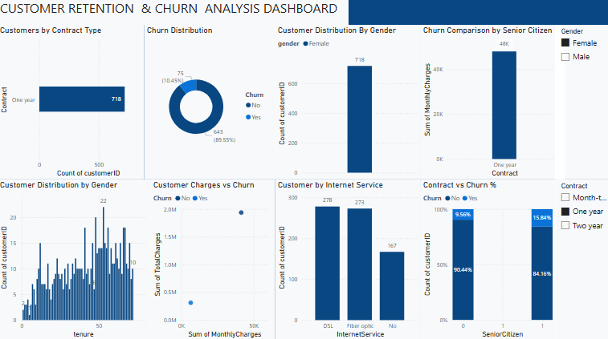

# FUTURE_DS_02

## Customer Retention & Churn Analysis Dashboard

This project focuses on analyzing telecom customer data to understand churn patterns, retention trends, and key factors affecting customer loss.  
An interactive Power BI dashboard was created to visualize customer behavior and provide actionable insights.

---

## 📊 Project Objective

To identify:

- Why customers are leaving (churn reasons)
- Which customer segments are at high risk
- Retention trends based on tenure, contract type, and services
- Key business insights to improve customer retention

---

## 🛠 Tools Used

- Power BI
- Excel / CSV Dataset

---

## 📁 Dataset

Telecom Customer Churn Dataset containing:

- Customer demographics
- Contract details
- Monthly and total charges
- Service usage
- Churn status

---

## 📈 Key Insights

- Month-to-month contract customers show the highest churn rate  
- Customers with higher monthly charges are more likely to churn  
- New customers churn more in the initial tenure period  
- Fiber optic internet users show higher churn tendency  
- Customers with longer contracts show better retention  

---

## 📌 Deliverables

- Power BI Dashboard (.pbix)
- Dataset (.csv)
- Dashboard Screenshot
- Project Documentation (README)

---

## 📷 Dashboard Preview

